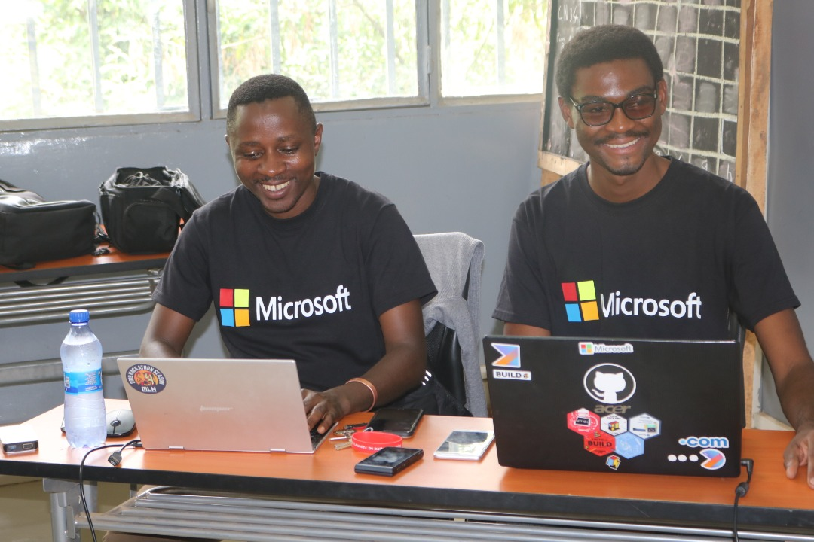

---
# Display name
title: Albert Gubanja
#avatar_image: "user-full.png"

# Username (this should match the folder name)
authors:
- admin

# Is this the primary user of the site?
superuser: true

# Role/position
role: Beta Microsoft Student Partner

# Organizations/Affiliations
organizations:
- name: Ecole Supérieur d'Informatique Salama
  url: "https://www.esisalama.com/index.php"

# Short bio (displayed in user profile at end of posts)
bio: My research interests include distributed artificial intelligence, networkings and cybersecurity.

interests:
- Artificial Intelligence
- Machine and deep Learning
- Text mining
- Web developement
- Python programming
- Network administration

education:
  courses:
  - course: Bachelier en Philosophie
    institution: Université Loyola du Congo
    year: 2015
  - course: IT Essentials
    institution: CISCO Academy
    year: 2018
  - course: CCNA I Switching and Rooting
    institution: CISCO Academy
    year: 2019
  - course: CCNA II Switchin and Rooting
    institution: CISCO Academy
    year: 2019

# Social/Academic Networking
# For available icons, see: https://sourcethemes.com/academic/docs/page-builder/#icons
#   For an email link, use "fas" icon pack, "envelope" icon, and a link in the
#   form "mailto:your-email@example.com" or "#contact" for contact widget.
social:
- icon: envelope
  icon_pack: fas
  link: '#contact'  # For a direct email link, use "albert.gubanja@studentpartner.com".
- icon: twitter
  icon_pack: fab
  link: https://twitter.com/Albertandemsj
- icon: google-scholar
  icon_pack: ai
  link: https://scholar.google.co.uk/citations?user=sIwtMXoAAAAJ
- icon: github
  icon_pack: fab
  link: https://github.com/AndemusGBJ
# Link to a PDF of your resume/CV from the About widget.
# To enable, copy your resume/CV to `static/files/cv.pdf` and uncomment the lines below.
# - icon: cv
#   icon_pack: ai
#   link: files/cv.pdf

# Enter email to display Gravatar (if Gravatar enabled in Config)
email: ""

# Organizational groups that you belong to (for People widget)
#   Set this to `[]` or comment out if you are not using People widget.
user_groups:
- Researchers
- Visitors
---

Albert Gubanja, called Andemus by classemates, is a Beta Microsoft Sutdent Partner and Software engeniring student at ESIS (Ecole Supérieure d'Informatique Salama) in Lubumbashi. His research interests include distributed Machine Learning, Deep Learning, Text Mining, Programing with C# and Python, Networking adminstration, Cybersecurity and environnemental technologie. He leads the World Merit Lubumbashi, a Council of World Merit.

Albert Gubanja, called Andemus by classemates, is a Beta Microsoft Sutdent Partner and Software engeniring student at ESIS (Ecole Supérieure d'Informatique Salama) in Lubumbashi. His research interests include distributed Machine Learning, Deep Learning, Text Mining, Programing with C# and Python, Networking adminstration, Cybersecurity and environnemental technologie. He leads the World Merit Lubumbashi, a Council of World Merit.
